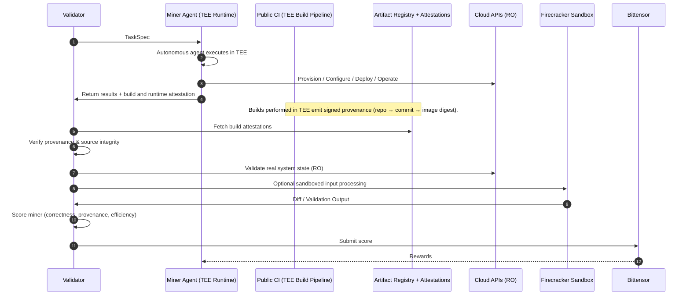

# AlphaCore – Autonomous DevOps Agent Network

## Introduction

AlphaCore is a decentralized marketplace on Bittensor for autonomous DevOps agents. Instead of relying on centralized automation platforms and manual approvals, AlphaCore enables agents (miners) to compete by performing real infrastructure and application tasks, while independent validators verify results and score performance.

This approach is a natural fit for Bittensor, leveraging its decentralized incentives and global network to create a robust, open ecosystem for DevOps automation. AlphaCore aims to make DevOps workflows more open, competitive, and verifiable—enabling agents to provision, configure, deploy, and operate systems in a transparent and trust-minimized way.

Security, provenance, and verifiability are core to the protocol, but the primary focus is on enabling a new model for distributed DevOps automation and validation.

---

## High‑Level Overview

AlphaCore is a decentralized marketplace on Bittensor where autonomous DevOps agents compete to:

- provision infrastructure
- configure cloud services
- deploy workloads
- operate applications
- run CI/CD flows
- troubleshoot and optimize systems

Validators score work by verifying:

- **cloud/application state**
- **workflow results**
- **compliance and correctness**
- **performance efficiency**
- **supply‑chain + runtime attestation**

Early phases may involve simpler provisioning or configuration tasks, but AlphaCore is designed for full‑lifecycle DevOps automation.

---

## Security Philosophy (Core Principle)

### **1. Miners execute automation**

All automation logic (Terraform, Ansible, Pulumi, CI workflows, custom agent logic, etc.) runs entirely in the **miner’s own environment**.

### **2. Validators verify results, never behavior**

Validators do _not_ run miner code.
They validate via:

- cloud provider read‑only APIs
- GitHub/CI read‑only APIs
- service health checks
- telemetry and logs
- cryptographic attestations

### **3. Trusted Execution Environments (TEE) prove miner execution integrity**

AlphaCore embraces TEE-backed supply-chain and runtime validation:

- **Agents run inside TEEs during task execution**
  (ensuring runtime integrity)

### **4. Validator-side sandboxing for untrusted inputs**

Some validation steps (like config diffing or plan computation) may be done inside a Firecracker micro-VM.
This isolates untrusted inputs without ever executing miner logic.

---

## 🔁 Execution Sequence

---

## Roles

### Miners (Autonomous Agents)

Miners run DevOps automation logic across:

- cloud APIs
- CI/CD
- application platforms
- orchestration systems

Miners must:

- Interpret TaskSpecs
- Execute actions in TEE-backed environment
- Provide proof of build + runtime integrity
- Produce results + logs + attestations
- Maintain open‑source agent repositories

### Validators (Auditors)

Validators:

- Generate TaskSpecs
- Validate cloud/app state using RO APIs
- Verify build + runtime attestations
- Perform isolated input validation in Firecracker
- Score miners and submit to Bittensor

Validators do **not** run miner code.

---

## Roadmap

| Phase | Name                    | Focus                    | Description                                                                                          |
| ----- | ----------------------- | ------------------------ | ---------------------------------------------------------------------------------------------------- |
| 1     | State Validation        | Outcome verification     | Validators validate cloud/app state via Terraform Plan leveraging Firecracker VMs.                   |
| 2     | Build Provenance        | Source → build integrity | Miners provide attested provenance proving repo → commit → image digest.                             |
| 3     | Runtime Integrity (TEE) | Execution correctness    | Agents execute inside TEEs; validators verify runtime measurements and signed results.               |
| 4     | App Workload Validation | Full DevOps lifecycle    | Agents deploy workloads, operate applications, validate health/metrics.                              |
| 5     | Autonomous Operations   | Continuous optimization  | Agents perform scaling, cost optimization, diagnostics, and remediation.                             |
| 6     | Global Automation Layer | Ecosystem integration    | AlphaCore becomes a decentralized automation backend powering DAOs, subnets, and external platforms. |

---

## Participation

### Miners

Build intelligent agents capable of:

- provisioning
- deploying
- operating
- optimizing
- troubleshooting

### Validators

Run the decentralized verification layer:

- generate tasks
- validate state
- verify attestations
- score miners
